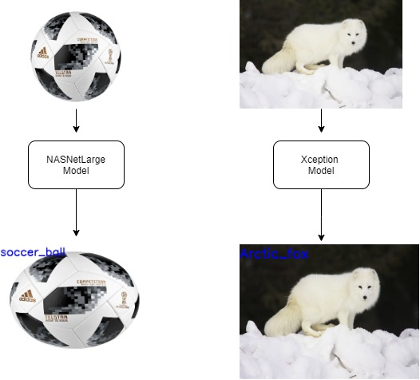

# Object-Classification-using-Pre-Trained-Models

## Definition

This project is object classification using pre-trained model. Two well-known models are used NasNetLarge and Xception.

## Description

The code begins by resizing the images to size that fit the model(NasNetLarge or Xception) then the image is pre-processed and then the model classifies the image. if the probability of classification exceeds a certain threshold then the results of the model will be reported otherwise the model failed to classify the image.

### Dependencies

#### install this libraries:
- numpy
- keras
- opencv
- glob
- tensorflow

#### This project based on Keras documentation found in this [link](https://keras.io/api/applications/)
